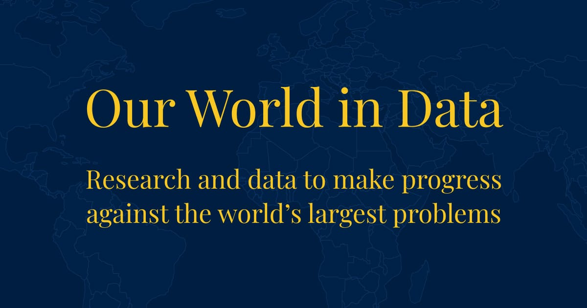

```{r setup, include=FALSE}
library(knitr)
knitr::opts_chunk$set(echo = TRUE)
```

## Overview

The dataset of this project uses a COVID-19 dataset and in this dataset contains statistics of COVID in countries around the world. The data has been collected since the start of the pandemic and was genereated by an organization known as Our World in Data in collaboration with the University of Oxford.

```{r organization_img, echo=FALSE, fig.cap="Our World in Data", out.width = '50%'}

```


### What major questions are you seeking to answer?

With this COVID-19 dataset, we want to see how the the the spread of COVID-19 in different countries around the world and where the most vaccinations have been administered. We also are want to see what the relationship between the deaths and vaccinations in each continent. Another big question that we want to answer is what does the total deaths in a location look like over time.

### What data will you use to answer those questions?

In order to see how COVID-19 has affected different countries around the world and how vaccinations were administered, we need the location and the most recent total cases and total vaccinations. To find the relationship between deaths and vaccinations, we need to sort the data of each continent by their latest data entry and take their total deaths per million and total vaccinations per hundred. To see how the total deaths in a location over time we will need the total deaths in each month from the earliest month to the most recent month.


